# graph-avatar

**Deterministic SVG avatars via recursive planar graph subdivision.**

Pass in four numbers in `[0, 1]` — get back a unique, reproducible geometric avatar. Same inputs always produce byte-for-byte identical SVG output. Zero dependencies.

```bash
npm install graph-avatar
```

---

## What It Looks Like

### Hue × Density Matrix

*v = 0.5, w = 0.2 held constant*

| | Red | Blue | Lime |
|---|---|---|---|
| d = 0.15 | 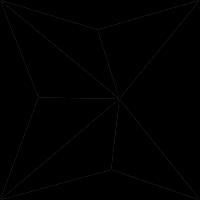 | 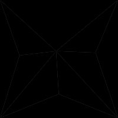 | 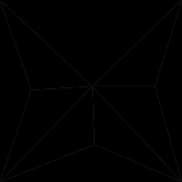 |
| d = 0.5 | 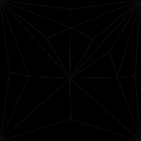 | 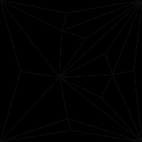 | 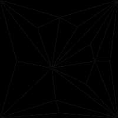 |
| d = 0.9 | 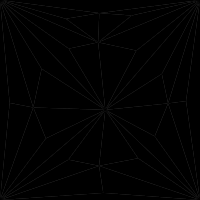 | 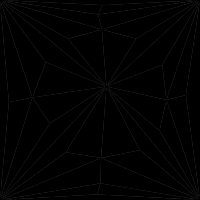 | 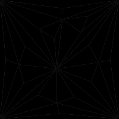 |

### Varying Density *(d)*

*h = blue, v = 0.5, w = 0.2*

| d = 0 | d = 0.25 | d = 0.5 | d = 0.75 | d = 1 |
|---|---|---|---|---|
| 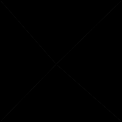 | 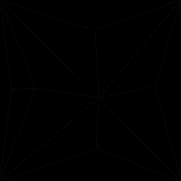 |  | 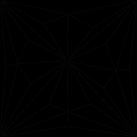 | 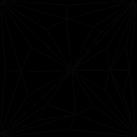 |

### Varying Variance *(v)*

*h = blue, d = 0.5, w = 0.2*

| v = 0 | v = 0.25 | v = 0.5 | v = 0.75 | v = 1 |
|---|---|---|---|---|
| 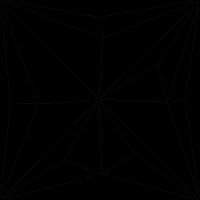 | 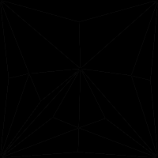 | 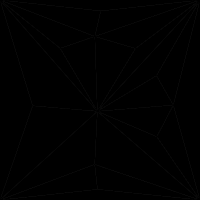 | 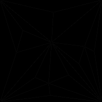 | 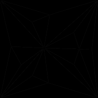 |

### Varying Border Width *(w)*

*h = blue, v = 0.5, d = 0.5*

| w = 0 | w = 0.25 | w = 0.5 | w = 0.75 | w = 1 |
|---|---|---|---|---|
| 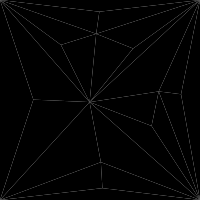 | 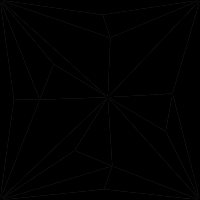 | 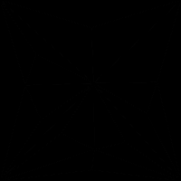 | 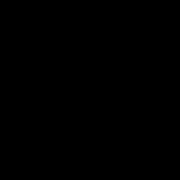 |  |

---

## Features

- **Deterministic** — identical inputs → identical SVG, every time
- **Zero dependencies** — ~3 KB gzipped, works everywhere
- **Pure SVG** — crisp at any size, no canvas or WebGL needed
- **Black borders** — clean tile outlines at any weight

---

## Quick Start

```typescript
import { generateAvatar, getHue } from 'graph-avatar';

const svg = generateAvatar({
  h: getHue('blue'),
  v: 0.5,
  d: 0.6,
  w: 0.3,
});

document.getElementById('avatar').innerHTML = svg;
```

---

## Parameters

All four parameters are normalised to `[0, 1]`.

| Param | Name | What it controls |
|-------|------|-----------------|
| `h` | Hue | Base color — maps to 0–360° on the HSL wheel |
| `v` | Variance | Lightness spread across tiles (0 = uniform, 1 = high contrast) |
| `d` | Density | Number of subdivisions (0 = 4 tiles, 1 = 64 tiles) |
| `w` | Width | Border thickness (0 = none, 1 = thickest) |

### h — Hue

Maps linearly to `0–360°` on the HSL colour wheel. Use `getHue()` for presets, or pass any value `0..1`.

### v — Variance

Controls how much lightness varies from tile to tile. Hue and saturation are held constant.

- `v = 0` → tiles are nearly the same shade (± 3% lightness)
- `v = 1` → strong dark/light contrast (± 30% lightness)

### d — Density

Controls recursive subdivision steps:

```
steps = round(d × 20)
nodes = 5 + steps
tiles = 4 + 3 × steps
```

- `d = 0` → 4 tiles, simple geometry
- `d = 0.5` → 34 tiles, moderate detail
- `d = 1` → 64 tiles, high complexity

### w — Width

Controls the black border stroke on each tile from `0` (invisible) to `4px` on the 400×400 internal canvas. Borders are always solid black (`#000`) regardless of tile color.

---

## Hue Presets

| Preset | h value | HSL Hue |
|--------|---------|---------|
| red | ≈ 0.028 | 10° |
| blue | ≈ 0.611 | 220° |
| lime | ≈ 0.236 | 85° |

```typescript
import { HUE_PRESETS, getHue } from 'graph-avatar';

HUE_PRESETS.red;   // 0.0277...
HUE_PRESETS.blue;  // 0.6111...
HUE_PRESETS.lime;  // 0.2361...

getHue('blue'); // equivalent to HUE_PRESETS.blue
```

---

## API Reference

### `generateAvatar(input, options?)`

Returns a complete SVG string.

```typescript
function generateAvatar(input: AvatarInput, options?: AvatarOptions): string;
```

```typescript
interface AvatarInput {
  h: number; // Hue [0..1]
  v: number; // Variance [0..1]
  d: number; // Density [0..1]
  w: number; // Width [0..1]
}

interface AvatarOptions {
  size?: number; // SVG dimension in px (default: 400)
}
```

The internal coordinate space is always 400×400. The `size` option changes `width` and `height` attributes; the `viewBox` remains `0 0 400 400`.

### `getHue(preset)`

Returns the normalised `h` value for a named hue preset.

```typescript
type HuePreset = 'red' | 'blue' | 'lime';
function getHue(preset: HuePreset): number;
```

### `HUE_PRESETS`

Read-only object mapping preset names to `h` values.

---

## Usage Examples

### React

```jsx
import { generateAvatar } from 'graph-avatar';

function Avatar({ h, v, d, w, size = 64 }) {
  const svg = generateAvatar({ h, v, d, w });
  return ;
}
```

### Vue 3

```html
<template><div v-html="avatar" /></template>
<script setup>
import { computed } from 'vue';
import { generateAvatar } from 'graph-avatar';
const props = defineProps(['h','v','d','w']);
const avatar = computed(() => generateAvatar(props));
</script>
```

### Node.js

```javascript
import fs from 'fs';
import { generateAvatar, getHue } from 'graph-avatar';

fs.writeFileSync('avatar.svg', generateAvatar({
  h: getHue('lime'), v: 0.6, d: 0.9, w: 0.4,
}));
```

---

## Algorithm

#### Recursive Planar Subdivision

1. Start with a 400×400 square.
2. Fan-triangulate it into 4 triangles around a jittered centroid.
3. Repeat `round(d × 20)` times: find the largest tile by area, place a jittered interior point, fan-triangulate into 3 child triangles.

Result: a planar triangulation — non-overlapping triangles that tile the canvas exactly.

#### Color

- **Hue** is fixed per avatar at `h × 360°`.
- **Saturation** is fixed at 65%.
- **Lightness** follows a bounded random walk from a base of 52%:
  ```
  range = 3 + v × 27
  child.lightness = clamp(parent.lightness + uniform(−range, +range), 25, 82)
  ```

#### Determinism

Input values are serialised and hashed with **cyrb53**, folded to 32 bits, and fed to **Mulberry32** PRNG. The PRNG is consumed in a fixed order during construction — same inputs, same output, every time.

#### By The Numbers

After `k` subdivision steps (including the initial square split):

- **V** = 5 + k vertices
- **F** = 4 + 3k triangles
- **E** = 3 + 7k edges (verifiable via Euler's formula: V − E + F = 2)

---

## Building from Source

```bash
git clone https://github.com/your-org/graph-avatar
cd graph-avatar
npm install
npm run build
```

Open `examples/demo.html` in a browser for an interactive playground.

---

## License

MIT
